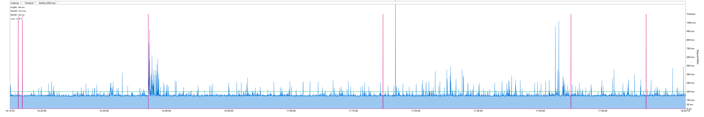

# SmokePing

[](https://ci.appveyor.com/project/moyada/ping-prober/branch/master)


SmokePing Go version, a latency logging and graphing and alerting system. It consists of a daemon process which organizes the latency measurements and a CGI which presents the graphs.

> Dependency Project: [go-ping](https://github.com/go-ping/ping) [go-chart](https://github.com/wcharczuk/go-chart)


# Usage

Download [release packages](https://github.com/moyada/ping-prober/releases) or execute `build.sh`.

```
usage: smokeping <host | -host=address>

Flags:
      --size=1024
                          Size of packet being sent, default is 1024.
      --output=/my/monitor/latency.png
                          Output file of the latency report, should be end with .png
```

Press `Control+C` to end the monitoring and output the report.

# Output Examples

